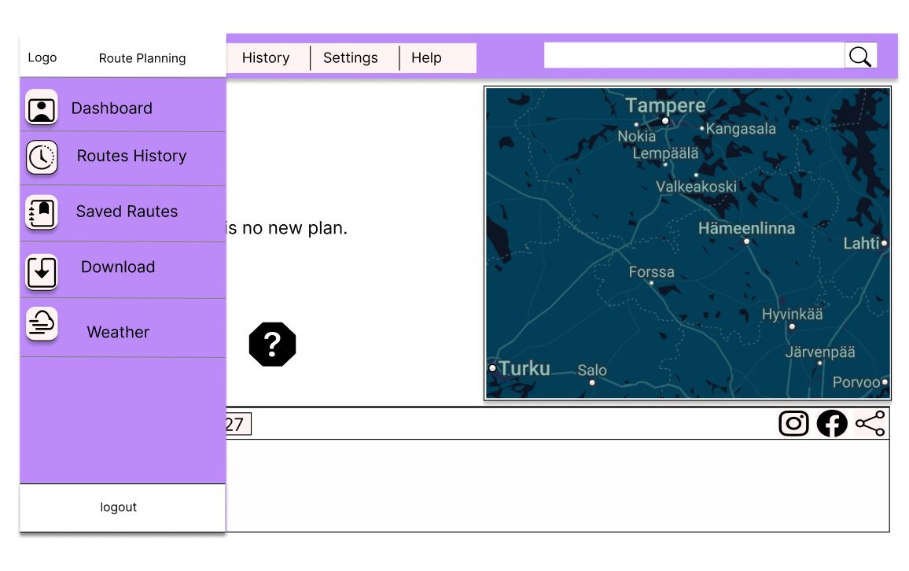

# Route Planning Application

This application is to create a customized route planning dashboard that users can access weather forecasts and the applications allows users plan safe by considering the current road conditions, traffic, and weather.

link to the prototype design (Figma) [RoutePlanApplication][1].

[1]: https://www.figma.com/design/kxYoTqCxPals6y310dGXNS/TeamIphone?node-id=0-1&t=fyKwLpM1UtABHyNf-1 "RoutePlanApplication"

<h3 align="left">Languages and Tools:</h3>
<p align="left"> <a href="https://getbootstrap.com" target="_blank" rel="noreferrer">  </a> <a href="https://www.chartjs.org" target="_blank" rel="noreferrer">  </a> <a href="https://www.w3schools.com/css/" target="_blank" rel="noreferrer">  </a> <a href="https://www.docker.com/" target="_blank" rel="noreferrer">  </a> <a href="https://expressjs.com" target="_blank" rel="noreferrer">  </a> <a href="https://www.figma.com/" target="_blank" rel="noreferrer">  </a> <a href="https://firebase.google.com/" target="_blank" rel="noreferrer">  </a> <a href="https://git-scm.com/" target="_blank" rel="noreferrer">  </a> <a href="https://graphql.org" target="_blank" rel="noreferrer">  </a> <a href="https://heroku.com" target="_blank" rel="noreferrer">  </a> <a href="https://www.w3.org/html/" target="_blank" rel="noreferrer">  </a> <a href="https://www.java.com" target="_blank" rel="noreferrer">  </a> <a href="https://developer.mozilla.org/en-US/docs/Web/JavaScript" target="_blank" rel="noreferrer">  </a> <a href="https://www.linux.org/" target="_blank" rel="noreferrer">  </a> <a href="https://mochajs.org" target="_blank" rel="noreferrer">  </a> <a href="https://www.mongodb.com/" target="_blank" rel="noreferrer">  </a> <a href="https://www.mysql.com/" target="_blank" rel="noreferrer">  </a> <a href="https://nodejs.org" target="_blank" rel="noreferrer">  </a> <a href="https://www.php.net" target="_blank" rel="noreferrer">  </a> <a href="https://reactjs.org/" target="_blank" rel="noreferrer">  </a> <a href="https://redux.js.org" target="_blank" rel="noreferrer">  </a> <a href="https://sass-lang.com" target="_blank" rel="noreferrer">  </a> <a href="https://www.selenium.dev" target="_blank" rel="noreferrer">  </a> <a href="https://spring.io/" target="_blank" rel="noreferrer">  </a> <a href="https://travis-ci.org" target="_blank" rel="noreferrer">  </a> <a href="https://webpack.js.org" target="_blank" rel="noreferrer">  </a> </p>

<h3 align="left">How to run:</h3>
*frontend: npm start
*rest: mvn spring-boot:run

<h3 align="left">Database that used with docker</h3>
*mariadb -u root -p

<h3 align="left">Design and Figures:</h3>





---

<h3 align="left">Git Hooks</h3>
<h5 align="left">Scenario:</h5>
The pre-commit hook to allow commits only to the 'client/' and 'design/' folders, and to be applied only on the FE_DEV branch. Any other folder modifications should be blocked.


Pre-commit Hook Script:

```
#!/bin/bash

# Define the allowed folders
allowed_folders=("client/" "design/")

# Get the current branch
current_branch=$(git rev-parse --abbrev-ref HEAD)

# Only apply restriction to the 'FE_DEV' branch
if [[ "$current_branch" == "FE_DEV" ]]; then
    # Get the list of staged files
    staged_files=$(git diff --cached --name-only)

    # Check if any staged file is outside the allowed folders
    for file in $staged_files; do
        allowed=false
        for folder in "${allowed_folders[@]}"; do
            if [[ "$file" == "$folder"* ]]; then
                allowed=true
                break
            fi
        done
        if [[ "$allowed" == false ]]; then
            echo "Error: Only changes to 'client/' and 'design/' folders are allowed on the FE_DEV branch."
            exit 1  # Block the commit
        fi
    done
fi

# If all staged files are in allowed folders, allow the commit
exit 0
```

Add the above script on: 'nano pre-commit', and save the pre-commit file;

After this, the hook should work, and code outside of those directories cannot be committed.

**NOTE:** _this needs to be followed for BE_DEV branch as well where we will restrict those 2 folders (related to FE). This way we keep the segregation between FE and BE, yet integrated._

Pre-commit Hook Script:

```
#!/bin/bash

# Define the folders to restrict (we want to restrict these in BE_DEV)
restricted_folders=("client/" "design/")

# Get the current branch
current_branch=$(git rev-parse --abbrev-ref HEAD)

# Only apply restriction to the 'BE_DEV' branch
if [[ "$current_branch" == "BE_DEV" ]]; then
    # Get the list of staged files
    staged_files=$(git diff --cached --name-only)

    # Check if any staged file is in the restricted folders
    for file in $staged_files; do
        for folder in "${restricted_folders[@]}"; do
            if [[ "$file" == "$folder"* ]]; then
                echo "Error: Changes to '$folder' are not allowed on the BE_DEV branch."
                exit 1  # Block the commit
            fi
        done
    done
fi

# If no restricted folders were modified, allow the commit
exit 0
```
